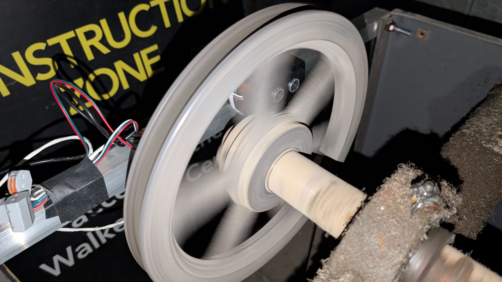
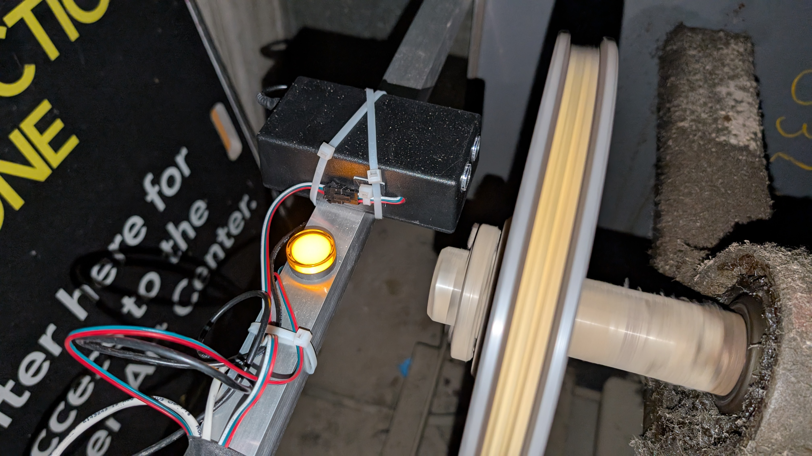
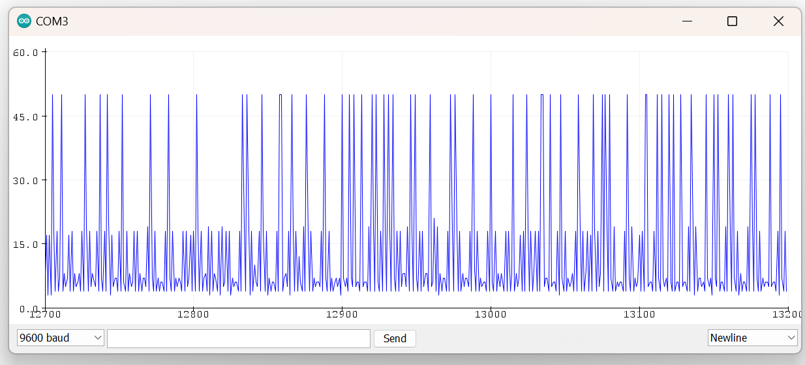

## Arduino Industrial Fan Status Indicator

This project exists as a part of larger infrasctructure to support the laser cutter & digital fabrication space at the Walker Art Center. The laser cutter is vented using an inline blower fan into our paint booth's air handling system several rooms over. It is important that both the inline fan and the building's air handling unit (AHU) are on during laser operation. 

It is easy to verify the status of the inline blower as it is next to the laser, but with the AHU in a separate location we needed a feedback system to monitor that the start signal was successfully recieved and alert if the unit turned off for any reason.

  
  

## Behavior

The device uses an ultrasonic sensor to detect passing spokes on the belt and pully system driving the AHU, eliminating any possible ambiguity as to the system's operation. It does this by writing the distance output from the sensor at short intervals into a circular buffer, evaluating for the maximum and minimum distances within the buffer, and triggering a relay if the difference between them exceeds a set threshold. If the fan stops spinning, regardess of whether the pully lands with a spoke or hole in front of the sensor, the buffer will fill up with identical values, and with the threshold no longer met the relay will be deactivated. 

## Required components

* 1x Arduino Uno
* 1x HC-SR04 Ultrasonic Sensor
* 1x 5v Relay Module
* Jumper wire (as needed)
* 2x 24v Indicator lamp
* 1x Project enclosure
* 1x 9v Barrel-jack PSU.
* Wago connectors (as needed)
* Two-conductor stranded wire (as needed)

## Schematic Diagram

## Note
<em>sample expected serial output:</em> 

